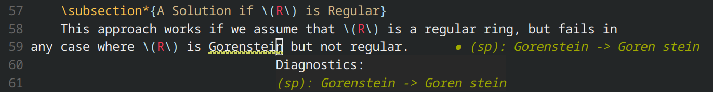
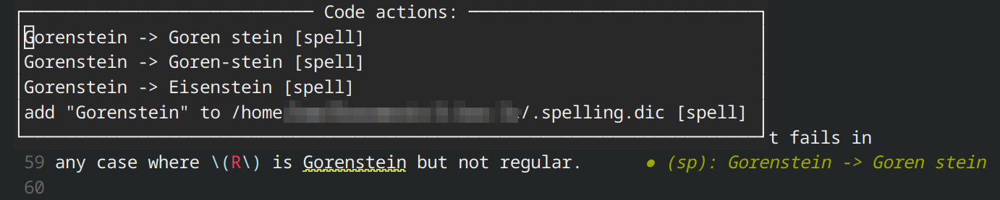

# spelllsp

A [Language Server Protocol](https://microsoft.github.io/language-server-protocol/) server for spellchecking in LaTeX source files. **This is a poorly-written, barely-tested, amateurish project, so be careful <3**

## Building

Spelllsp depends on the system libraries `libhunspell` and `libpcre2-8`, which must be installed before building. It also depends on the [lsp-framework](https://github.com/leon-bckl/lsp-framework) library, which is included as a git submodule, so make sure to run `git submodule update --init` to ensure you have an up-to-date version. To build, create a build directory, run CMake, then use CMake to build the project:

```bash
$ mkdir build && cmake -B build/ && cmake --build build/
```

## Setup

Spelllsp provides no configuration options, but does support different languages, as long as the appropriate `hunspell` dictionary is installed. I use it with `nvim` and configure it like this:

```lua
vim.lsp.config['spell'] = {
    cmd = { '/path/to/spelllsp', 'en_US' },
    filetypes = { 'tex' },
    root_markers = { '.git' }
}
vim.lsp.enable('spell')
```

Specifying the language `en_US` indicates that spelllsp can find a dictionary file `/usr/share/hunspell/en_US.dic` and an affix file `/usr/share/hunspell/en_US.aff`, which can be installed via the system package manager (for example, the package `extra/hunspell-en_us` on Arch Linux). 

## Usage

Spelllsp reports spelling errors as LSP diagnostics with `INFO` severity:



It will attempt to ignore LaTeX commands and their arguments. For example, `\usepackage[a4paper]{geometry}` would be ignored entirely. There is an exception for commands like `\textit`, `\textbf`, etc. Parsing is done with a relatively simple regex and isn't aware of LaTeX semantics, so hopefully this covers most of the real cases it might encounter. 

Spelllsp will also supply spelling corrections as LSP code actions: 



Aside from the corrections reported by `hunspell`, there will be an option to add the word to a local dictionary file, which will be placed in the workspace's root path according to the LSP client. 

